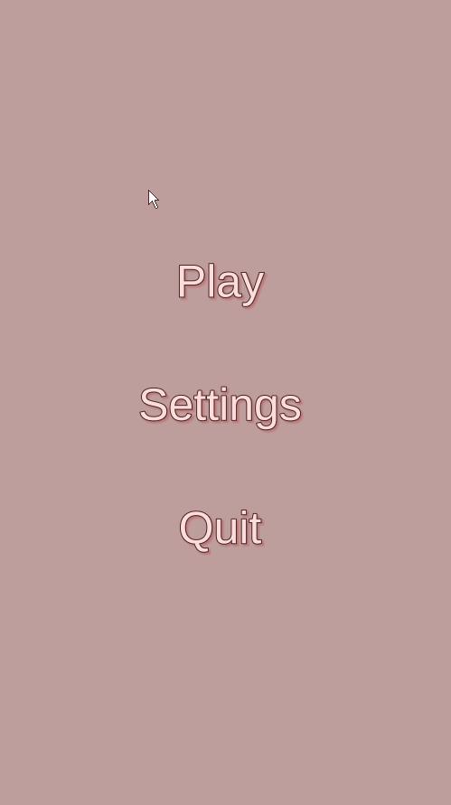

# TetraPlus
## THIS IS STILL A WORK IN PROGRESS

TetraPlus is a Tetris game made using Unity. TetraPlus comes packed with different features and add-ons to make the game fun
and enjoyable for the user. 

                                                  !!!IMPORTANT!!!
Description of all features is still in progress, there maybe additional features added on later on, or some features might be taken out.

                                                  !!!IMPORTANT!!!
                                                  
### Images & Videos  
1. Gameplay Video

# Features
### 1. Tetrimo color and design
Different colors for the tetrimo will be available for the user to choose from with additional Tetrimo styles. 

### 2. Background color and design (Themes)
Different backgrounds and themes for the user to choose from that could compliment the style of the Tetrimos or that could make playing
the game for the user a unique experience.

### 3. Sounds and music
Different sounds and music will also be available for the user to chose from and unlock while they play.

### 4. Goals/Achievements
Goals and achievements help the user get P-coins to buy different Tetrimo designs and themes. These goals range from simple tasks like 
clearing 4 lines at once(Tetris) to doing 3 back-to-back Tetris clears(4 line clears).

Achievements will be similar to goals, but they will be achieved in the long rong. The more you play the game, the more challanges you will
accomplish to unlock those achievements.

### 5. Different sizes of playing field
The original size playing field for Tetris is a 10x20 play area, with the addition of small, large and X-Large play areas, users can enjoy 
playing Tetris on new playing fields. These playing fields will be unlocked by using P-coins or through certain challanges/acheievements. 

### 6. Highscores
Highscores will be saved localy and also saved and compared throughout the users country and the world.

### 7. In-game currency (P-Coins)
TetraPlus uses P-coins as its in-game currency. P-coins are used to purchase different sounds and music, as well as different backgrounds
and Tetrimo colors/designs. 

P-coins are also earned passively. They are awarded to you at the end of the game depending on what your score is. The higher the score,
the more coins you will get.

